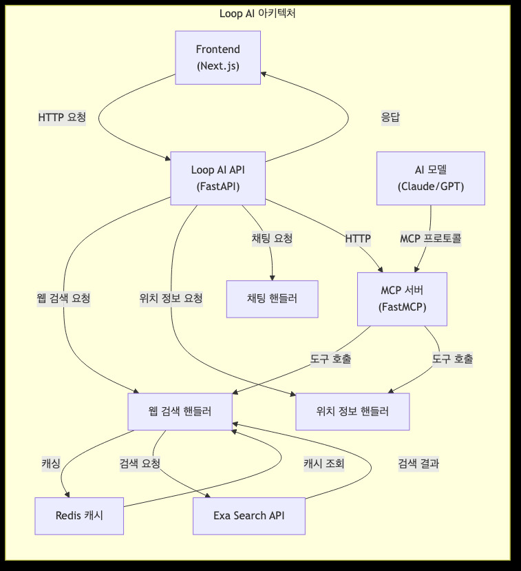
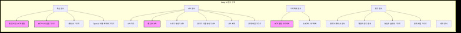

# Loop AI 아키텍처 이미지

이 문서는 Loop AI 프로젝트의 아키텍처와 문서 구조를 시각적으로 보여주는 이미지 파일들에 대한 설명입니다.

## 아키텍처 다이어그램

아래 이미지는 Loop AI의 전체 아키텍처를 보여줍니다. 이 다이어그램은 Frontend, API 서버, MCP 서버, 각종 핸들러, 외부 API 등의 관계를 시각화합니다.



### 주요 컴포넌트

- **Frontend (Next.js)**: 사용자 인터페이스
- **Loop AI API (FastAPI)**: 백엔드 API 서버
- **MCP 서버 (FastMCP)**: Model Context Protocol 서버
- **웹 검색 핸들러**: 웹 검색 기능 처리
- **위치 정보 핸들러**: 위치 정보 검색 처리
- **채팅 핸들러**: 채팅 기능 처리
- **Redis 캐시**: 검색 결과 캐싱
- **Exa Search API**: 외부 검색 API
- **AI 모델 (Claude/GPT)**: 인공지능 모델

## 문서 구조 다이어그램

아래 이미지는 Loop AI 프로젝트의 문서 구조를 보여줍니다. 이 다이어그램은 핵심 문서, API 문서, 아키텍처 문서, 연구 문서, 배포 문서 등의 관계를 시각화합니다.



### 주요 문서 카테고리

- **핵심 문서**: 웹 검색 및 MCP 통합, MCP 서버 설정 가이드 등
- **API 문서**: 웹 검색 API, 스토리 생성기 API 등
- **아키텍처 문서**: MCP 통합 아키텍처, LLMOPS 아키텍처 등
- **연구 문서**: 한국어 특화 AI 분석, 재앙적 망각 분석 등
- **배포 문서**: 배포 관련 문서

## 이미지 파일 정보

### PNG 형식

- `docs/images/architecture.png`: 아키텍처 다이어그램 (PNG)
- `docs/images/documentation.png`: 문서 구조 다이어그램 (PNG)

### JPG 형식

- `docs/images/architecture.jpg`: 아키텍처 다이어그램 (JPG)
- `docs/images/documentation.jpg`: 문서 구조 다이어그램 (JPG)

### Mermaid 소스 파일

- `docs/images/architecture.mmd`: 아키텍처 다이어그램 Mermaid 소스
- `docs/images/documentation.mmd`: 문서 구조 다이어그램 Mermaid 소스

## 이미지 생성 방법

이 이미지들은 Mermaid 다이어그램을 사용하여 생성되었습니다. 다이어그램을 수정하려면 다음 단계를 따르세요:

1. `.mmd` 파일을 편집합니다.
2. Mermaid CLI를 사용하여 PNG로 변환합니다:
   ```bash
   mmdc -i docs/images/architecture.mmd -o docs/images/architecture.png -b transparent
   ```
3. ImageMagick을 사용하여 JPG로 변환합니다:
   ```bash
   convert docs/images/architecture.png docs/images/architecture.jpg
   ```

## 다이어그램 업데이트

프로젝트 구조나 아키텍처가 변경될 경우, 다이어그램을 업데이트하여 최신 상태를 유지하는 것이 중요합니다. 다이어그램 업데이트 후에는 이 문서에 명시된 방법으로 이미지 파일을 다시 생성하세요. 