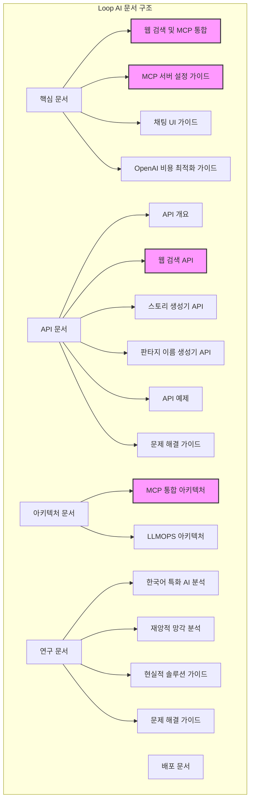

# Loop AI 웹 검색 및 MCP 통합 문서화 요약

## 개요

이 문서는 Loop AI 프로젝트에 구현된 웹 검색 기능과 MCP(Model Context Protocol) 서버 통합에 대한 문서화 작업을 요약합니다. 문서화 작업은 사용자와 개발자가 시스템을 이해하고 활용할 수 있도록 상세한 정보를 제공하는 것을 목표로 했습니다.

## 문서 구조

웹 검색 및 MCP 통합 관련 문서는 다음과 같은 구조로 조직되어 있습니다:

## 주요 문서 요약

### 1. 핵심 문서

#### [웹 검색 및 MCP 통합](./WEBSEARCH_MCP_INTEGRATION.md)

이 문서는 웹 검색 기능과 MCP 서버 통합에 대한 종합적인 설명을 제공합니다. 구현된 기능, 아키텍처 다이어그램, 개발 단계 시뮬레이션, AI 요약 기능, 채팅 핸들러 통합, 설정 및 사용법, 향후 계획, 문제 해결 방법 등을 다룹니다.

#### [MCP 서버 설정 가이드](./MCP_SETUP_GUIDE.md)

MCP 서버를 설정하는 방법에 대한 상세한 가이드입니다. 사전 요구사항, 설치 방법, 서버 구성, 엔드포인트, 로컬 실행 방법, 클라이언트 설정, 배포 고려사항, 문제 해결 방법 등을 포함합니다.

### 2. API 문서

#### [웹 검색 API](./api/web-search-api.md)

웹 검색 API의 엔드포인트, 요청/응답 형식, MCP 통합, 캐싱, 에러 처리, 사용 예제 등을 상세히 설명합니다. 이 문서는 개발자가 웹 검색 API를 활용하는 데 필요한 모든 정보를 제공합니다.

### 3. 아키텍처 문서

#### [MCP 통합 아키텍처](./architecture/MCP_INTEGRATION.md)

MCP 서버 통합의 아키텍처를 설명합니다. 아키텍처 다이어그램, 서버 구성, 도구 구현, 도구 매핑, 클라이언트 연결, 개발 모드, 배포 고려사항, 향후 계획 등을 포함합니다.

## 문서 간 관계

1. **핵심 문서와 API 문서**: 핵심 문서는 전체 시스템의 개요와 주요 기능을 설명하고, API 문서는 각 API 엔드포인트의 상세한 사용법을 제공합니다.

2. **핵심 문서와 아키텍처 문서**: 핵심 문서는 사용자 관점에서 시스템을 설명하고, 아키텍처 문서는 개발자 관점에서 시스템의 구조와 동작 방식을 설명합니다.

3. **API 문서와 아키텍처 문서**: API 문서는 외부 인터페이스를 설명하고, 아키텍처 문서는 내부 구현을 설명합니다.

## 문서화 작업 결과

웹 검색 및 MCP 통합 관련 문서화 작업을 통해 다음과 같은 결과를 얻었습니다:

1. **체계적인 문서 구조**: 문서를 목적과 대상에 따라 체계적으로 구성하여 필요한 정보를 쉽게 찾을 수 있도록 했습니다.

2. **상세한 API 문서**: 웹 검색 API의 모든 엔드포인트, 매개변수, 응답 형식을 상세히 문서화하여 개발자가 API를 쉽게 활용할 수 있도록 했습니다.

3. **아키텍처 설명**: MCP 통합의 아키텍처를 다이어그램과 함께 설명하여 시스템의 구조와 동작 방식을 이해하기 쉽게 했습니다.

4. **사용 예제**: 각 API의 사용 예제를 제공하여 실제 구현에 도움이 되도록 했습니다.

5. **문제 해결 가이드**: 일반적인 문제와 해결 방법을 문서화하여 사용자와 개발자가 문제를 신속하게 해결할 수 있도록 했습니다.

## 향후 문서화 계획

1. **사용자 피드백 반영**: 문서 사용자의 피드백을 수집하여 문서를 지속적으로 개선합니다.

2. **실제 API 연동 문서화**: 시뮬레이션에서 실제 웹 검색 API로 전환 시 관련 문서를 업데이트합니다.

3. **추가 MCP 도구 문서화**: 새로운 MCP 도구가 개발될 때마다 관련 문서를 추가합니다.

4. **튜토리얼 작성**: 단계별 튜토리얼을 작성하여 사용자가 시스템을 쉽게 배울 수 있도록 합니다.

5. **비디오 튜토리얼**: 복잡한 기능에 대한 비디오 튜토리얼을 제작하여 문서를 보완합니다.

## 결론

Loop AI 프로젝트의 웹 검색 및 MCP 통합 기능에 대한 문서화 작업은 사용자와 개발자가 시스템을 이해하고 활용하는 데 필요한 정보를 제공하는 것을 목표로 했습니다. 체계적인 문서 구조, 상세한 API 문서, 아키텍처 설명, 사용 예제, 문제 해결 가이드 등을 통해 이 목표를 달성했습니다. 향후에는 사용자 피드백을 반영하고 새로운 기능에 대한 문서를 추가하여 문서의 품질을 지속적으로 개선할 계획입니다. 