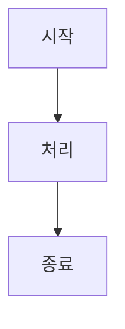

# Loop AI 프로젝트 문서

이 디렉토리에는 Loop AI 프로젝트에 대한 문서가 포함되어 있습니다. 각 문서는 프로젝트의 특정 측면을 설명합니다.

## 핵심 문서

- [웹 검색 및 MCP 통합](./WEBSEARCH_MCP_INTEGRATION.md) - 웹 검색 기능과 MCP 서버 통합에 대한 종합적인 문서
- [MCP 서버 설정 가이드](./MCP_SETUP_GUIDE.md) - MCP 서버 설정 및 사용 방법
- [채팅 UI 가이드](./CHAT_UI_GUIDE.md) - 채팅 UI 컴포넌트 및 기능 설명
- [OpenAI 비용 최적화 가이드](./OPENAI_COST_OPTIMIZATION_KR.md) - OpenAI API 사용 비용 최적화 전략 (한국어)
- [문서화 작업 요약](./DOCUMENTATION_SUMMARY.md) - 웹 검색 및 MCP 통합 문서화 작업 종합 요약
- [아키텍처 이미지](./ARCHITECTURE_IMAGES.md) - 아키텍처 및 문서 구조 다이어그램 이미지

## API 문서

- [API 개요](./api/README.md) - API 서비스 개요 및 사용 방법
- [웹 검색 API](./api/web-search-api.md) - 웹 검색 API 엔드포인트 및 사용법
- [스토리 생성기 API](./api/story-generator.md) - 스토리 생성 API 사용법
- [판타지 이름 생성기 API](./api/fantasy-names.md) - 판타지 이름 생성 API 사용법
- [API 예제](./api/examples.md) - 다양한 API 사용 예제
- [문제 해결 가이드](./api/troubleshooting.md) - API 관련 문제 해결 방법

## 아키텍처 문서

- [MCP 통합 아키텍처](./architecture/MCP_INTEGRATION.md) - MCP 서버 통합 아키텍처 설명
- [LLMOPS 아키텍처](./architecture/LLMOPS_ARCHITECTURE.md) - LLM 운영 아키텍처 개요

## 연구 문서

- [한국어 특화 AI 분석](./research/KOREAN_SPECIALIZED_AI_ANALYSIS.md) - 한국어 특화 AI 모델 분석
- [재앙적 망각 분석](./research/CATASTROPHIC_FORGETTING_ANALYSIS.md) - 모델의 재앙적 망각 현상 분석
- [현실적 솔루션 가이드](./research/REALISTIC_SOLUTION_GUIDE.md) - 실제 구현 가능한 솔루션 가이드
- [문제 해결 가이드](./research/TROUBLESHOOTING_GUIDE.md) - 연구 관련 문제 해결 방법

## 배포 문서

배포 관련 문서는 [deployment](./deployment) 디렉토리에 있습니다.

## 문서 작성 가이드

### 새 문서 추가

1. 적절한 디렉토리에 마크다운(.md) 파일 생성
2. 문서 상단에 제목과 간단한 설명 추가
3. 필요한 경우 목차 추가
4. 이 README.md 파일에 새 문서 링크 추가

### 문서 형식

모든 문서는 마크다운 형식으로 작성하며, 다음 구조를 따르는 것이 좋습니다:

```markdown
# 문서 제목

## 개요

간단한 설명...

## 목차

- [섹션 1](#섹션-1)
- [섹션 2](#섹션-2)
...

## 섹션 1

내용...

## 섹션 2

내용...
```

### 코드 예제

코드 예제는 언어를 명시하여 포함합니다:

```python
def example_function():
    return "Hello, World!"
```

### 다이어그램

다이어그램은 Mermaid 문법을 사용합니다:

