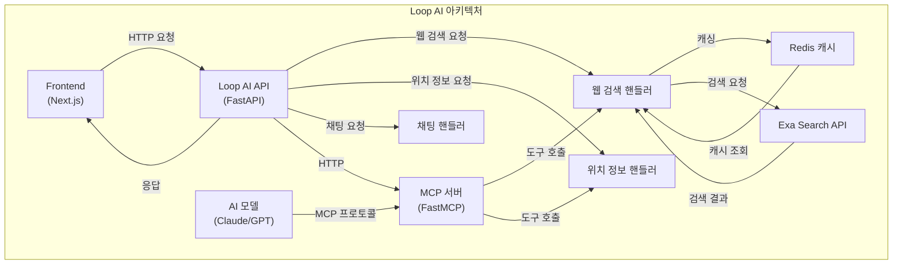

# 웹 검색 및 MCP 통합 문서

## 개요

이 문서는 Loop AI 프로젝트에 구현된 웹 검색 기능과 MCP(Model Context Protocol) 서버 통합에 대해 설명합니다. 이 기능은 사용자와 AI 모델이 실시간 웹 정보에 접근할 수 있도록 합니다.

## 구현된 기능

### 1. 웹 검색 핸들러

웹 검색 핸들러(`WebSearchHandler`)는 다음과 같은 기능을 제공합니다:

- 다양한 검색 소스 지원 (web, research, wiki, github, company)
- Redis 기반 결과 캐싱 (10분 TTL)
- 검색어에 따른 맞춤형 결과 생성
- AI 기반 검색 결과 요약 (마크다운 형식)
- 성능 통계 및 모니터링

```python
class WebSearchHandler:
    """
    🔥 기가차드급 웹 검색 핸들러
    - MCP Exa Search 통합
    - Redis 캐싱 (10분 TTL) - 현대적인 redis-py 사용
    - 다양한 검색 소스 (web, research, wiki, github, company)
    - AI 요약 및 후처리
    - 성능 최적화 및 비용 절약
    """
```

### 2. API 엔드포인트

FastAPI를 사용하여 다음과 같은 웹 검색 관련 엔드포인트를 구현했습니다:

- `POST /api/web-search`: 웹 검색 실행
- `GET /api/web-search/stats`: 웹 검색 통계 조회
- `DELETE /api/web-search/cache`: 웹 검색 캐시 클리어

### 3. MCP 서버 통합

MCP 서버는 AI 모델이 웹 검색 도구를 직접 사용할 수 있도록 합니다:

```python
# MCP 서버 설정
if MCP_AVAILABLE:
    try:
        # MCP 서버 초기화
        mcp_server = FastMCP("loop_ai", stateless_http=True)
        
        # MCP 웹 검색 도구 등록
        @mcp_server.tool()
        def web_search(query: str, num_results: int = 5):
            # 웹 검색 도구 구현
            # ...
        
        # MCP 앱 마운트
        app.mount("/mcp", mcp_server.streamable_http_app())
    except Exception as e:
        logger.error(f"❌ MCP 서버 초기화 실패: {e}")
        mcp_server = None
```

## 아키텍처 다이어그램



## 개발 단계 시뮬레이션

현재 개발 단계에서는 실제 웹 검색 API 연동 대신 시뮬레이션 결과를 사용합니다:

```python
def _generate_simulation_results(self, query: str, num_results: int = 5) -> List[Dict]:
    """시뮬레이션 검색 결과 생성"""
    logger.info(f"시뮬레이션 검색 결과 생성: '{query}'")
    
    # 검색어에 따라 다양한 결과 생성
    if "날씨" in query or "기상" in query:
        # 날씨 관련 시뮬레이션 결과
        # ...
    elif "뉴스" in query or "소식" in query:
        # 뉴스 관련 시뮬레이션 결과
        # ...
    # 기타 카테고리...
```

## AI 요약 기능

검색 결과는 AI를 통해 요약되어 사용자에게 제공됩니다:

```python
async def _summarize_with_ai(self, query: str, results: List[Dict]) -> str:
    """AI를 사용한 검색 결과 요약"""
    # AI 요약 프롬프트
    messages = [
        {
            "role": "system",
            "content": """당신은 기가차드 검색 어시스턴트입니다. 
            웹 검색 결과를 한국어로 요약하고, 각 링크를 markdown 형식으로 인용해주세요.
            - 핵심 내용을 3-4문장으로 요약
            - 관련 링크를 [제목](URL) 형식으로 제공
            - 기가차드다운 자신감 있는 톤 사용"""
        },
        # ...
    ]
    
    # 검색 결과에 따라 맞춤형 요약 생성
    # ...
```

## 채팅 핸들러 통합

채팅 핸들러는 사용자의 의도를 감지하여 웹 검색이 필요한 경우 웹 검색 핸들러를 호출합니다:

```python
async def detect_web_search_intent(self, message: str) -> Tuple[bool, str]:
    """웹 검색 의도 감지"""
    # 웹 검색 키워드 패턴
    web_search_patterns = [
        r"검색\s*해",
        r"찾아\s*봐",
        r"알려\s*줘",
        r"뭐야\?",
        r"누구야\?",
        r"어디야\?",
        r"언제야\?",
        r"최근\s*뉴스",
        r"최신\s*소식",
        # 추가 패턴...
    ]
    
    # 패턴 매칭을 통한 의도 감지
    # ...
```

## 설정 및 사용법

### 서버 설정

1. 필요한 패키지 설치:

```bash
pip install -r requirements.txt
```

2. 환경 변수 설정:

```bash
export OPENAI_API_KEY=your_api_key_here
export REDIS_URL=redis://localhost:6379  # 선택 사항: 캐싱 활성화
```

3. 서버 실행:

```bash
python run_server.py
```

### API 사용 예제

```python
import requests
import json

url = "http://localhost:8080/api/web-search"
payload = {
    "query": "서울 날씨",
    "source": "web",
    "num_results": 3,
    "include_summary": True
}
headers = {
    "Content-Type": "application/json"
}

response = requests.post(url, headers=headers, data=json.dumps(payload))
print(response.json())
```

### MCP 클라이언트 설정

Claude Desktop이나 Q CLI에서 MCP 서버를 사용하려면 다음 설정을 사용하세요:

```json
{
  "mcpServers": {
    "loop_ai": {
      "command": "npx",
      "args": [
        "mcp-remote",
        "http://localhost:8000/mcp/"
      ]
    }
  }
}
```

## 향후 계획

1. **실제 웹 검색 API 통합**:
   - Exa Search API 연동
   - 다양한 검색 소스 지원 확장

2. **MCP 도구 확장**:
   - 맞춤법 검사 도구
   - 스토리 생성 도구
   - 위치 정보 도구

3. **성능 최적화**:
   - 캐싱 전략 개선
   - 병렬 검색 처리

4. **보안 강화**:
   - API 키 관리
   - 요청 제한 및 스로틀링

## 문제 해결

### 일반적인 문제

1. **MCP 서버가 시작되지 않는 경우**:
   - MCP 라이브러리가 설치되었는지 확인
   - 포트 8000이 사용 가능한지 확인

2. **웹 검색 결과가 반환되지 않는 경우**:
   - 로그에서 오류 메시지 확인
   - OpenAI API 키가 올바르게 설정되었는지 확인
   - Redis 연결이 활성화되었는지 확인 (선택 사항)

3. **캐싱이 작동하지 않는 경우**:
   - Redis 서버가 실행 중인지 확인
   - REDIS_URL 환경 변수가 올바르게 설정되었는지 확인

## 참고 자료

- [MCP 공식 문서](https://modelcontextprotocol.io/)
- [FastMCP 문서](https://github.com/modelcontextprotocol/python-sdk)
- [MCP Inspector](https://github.com/modelcontextprotocol/inspector)
- [Redis 문서](https://redis.io/documentation)
- [FastAPI 문서](https://fastapi.tiangolo.com/) 